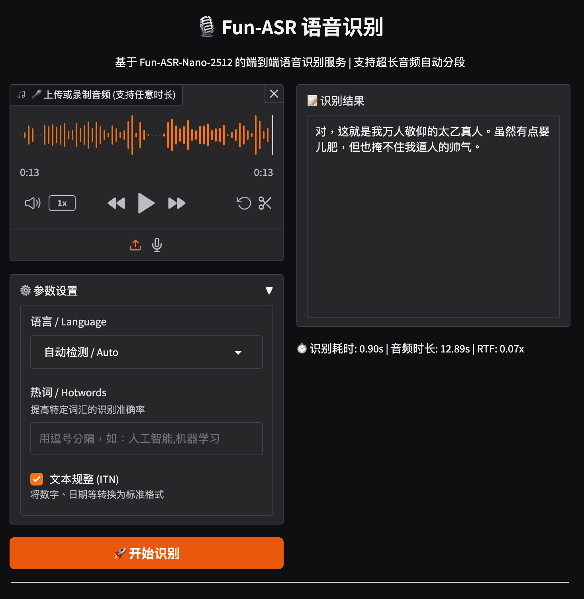

[English](README.md) | [简体中文](README_CN.md) | [繁體中文](README_TW.md) | [日本語](README_JP.md)

<div align="center">

# 🎙️ Fun-ASR All-in-One Docker

[](https://hub.docker.com/r/neosun/fun-asr)
[](https://hub.docker.com/r/neosun/fun-asr)
[](LICENSE)
[](https://github.com/neosun100/fun-asr-docker)

**Production-ready Speech Recognition Service based on Fun-ASR-Nano-2512**

One Docker command to get Web UI + REST API + WebSocket + Real-time Progress

[Quick Start](#-quick-start) • [Features](#-features) • [API Docs](#-api-reference) • [Performance](#-performance-benchmarks)

</div>

---

## 📸 Screenshot



---

## ✨ Features

| Feature | Description |
|---------|-------------|
| 🎯 **Fun-ASR-Nano-2512** | Alibaba's latest 800M parameter end-to-end ASR model |
| 🔊 **Auto VAD Segmentation** | Audio > 30s automatically segmented to avoid hallucination |
| 📊 **Real-time Progress** | UI progress bar + SSE streaming API |
| 🔌 **OpenAI Compatible** | `/v1/audio/transcriptions` compatible with Whisper API |
| 🌍 **Multi-language** | 31 languages, 7 Chinese dialects, 26 regional accents |
| ⚡ **High Performance** | RTF < 0.1, 6-min audio processed in ~40s |

---

## 🚀 Quick Start

```bash
docker run -d \
  --name fun-asr \
  --gpus '"device=0"' \
  -p 8189:8189 \
  -v fun-asr-models:/root/.cache \
  neosun/fun-asr:latest
```

First startup downloads model (~1.8GB), subsequent starts load from cache (~30s).

Open http://localhost:8189 🎉

---

## 📦 Installation

### Prerequisites

- Docker 20.10+
- NVIDIA GPU with 4GB+ VRAM
- NVIDIA Container Toolkit

### Docker Run

```bash
docker run -d \
  --name fun-asr \
  --gpus '"device=0"' \
  -p 8189:8189 \
  -v fun-asr-models:/root/.cache \
  --restart unless-stopped \
  neosun/fun-asr:v1.2.0
```

### Docker Compose

```yaml
# docker-compose.yml
services:
  fun-asr:
    image: neosun/fun-asr:v1.2.0
    container_name: fun-asr
    restart: unless-stopped
    ports:
      - "8189:8189"
    volumes:
      - fun-asr-models:/root/.cache
    deploy:
      resources:
        reservations:
          devices:
            - driver: nvidia
              device_ids: ["0"]
              capabilities: [gpu]

volumes:
  fun-asr-models:
```

```bash
docker compose up -d
```

### Health Check

```bash
curl http://localhost:8189/health
# {"status":"healthy","model_loaded":true,"vad_loaded":true,"gpu":{...}}
```

---

## ⚙️ Configuration

### Environment Variables

| Variable | Default | Description |
|----------|---------|-------------|
| `PORT` | `8189` | Service port |
| `MODEL_DIR` | `FunAudioLLM/Fun-ASR-Nano-2512` | Model path |

### Volume Mounts

| Path | Description |
|------|-------------|
| `/root/.cache` | Model cache (persistent) |

---

## 🖥️ Web UI

Access http://localhost:8189 for the web interface:

### Features
- 📤 Upload audio files (wav, mp3, m4a, flac, etc.)
- 🎤 Real-time microphone recording
- 📊 **Progress bar** for long audio processing
- ⚙️ Settings: Language, Hotwords, ITN

### Output Info
```
⏱️ Duration: 39.19s | Audio: 367.96s | RTF: 0.11x | VAD Segments: 33
```

---

## 📡 API Reference

### Endpoints

| Endpoint | Method | Description |
|----------|--------|-------------|
| `/health` | GET | Health check |
| `/v1/audio/transcriptions` | POST | Sync transcription (OpenAI compatible) |
| `/v1/audio/transcriptions/stream` | POST | Streaming transcription (SSE progress) |
| `/ws/transcribe` | WebSocket | Real-time streaming |
| `/docs` | GET | Swagger UI |

---

### 1. Sync Transcription API

**Best for**: Short audio (< 5 min)

```bash
curl -X POST http://localhost:8189/v1/audio/transcriptions \
  -F "file=@audio.wav" \
  -F "language=auto" \
  -F "hotwords=AI,machine learning" \
  -F "itn=true"
```

**Parameters**:

| Parameter | Type | Default | Description |
|-----------|------|---------|-------------|
| `file` | File | Required | Audio file |
| `language` | string | `auto` | Language: auto, zh, en, ja |
| `hotwords` | string | `""` | Comma-separated hotwords |
| `itn` | bool | `true` | Inverse text normalization |

**Response**:
```json
{
  "text": "The transcribed text...",
  "duration": 0.771,
  "audio_duration": 5.62
}
```

---

### 2. Streaming Transcription API (Recommended for Long Audio)

**Best for**: Long audio with real-time progress

```bash
curl -X POST http://localhost:8189/v1/audio/transcriptions/stream \
  -F "file=@long_audio.mp3" \
  -F "language=zh" \
  --no-buffer
```

**Response**: Server-Sent Events (SSE)

```
data: {"type": "progress", "current": 1, "total": 33, "text": "Partial text..."}
data: {"type": "progress", "current": 2, "total": 33, "text": "More text..."}
...
data: {"type": "complete", "text": "Full transcription...", "duration": 39.191}
```

**Event Types**:

| type | Description | Fields |
|------|-------------|--------|
| `progress` | Processing progress | `current`, `total`, `text` (partial) |
| `complete` | Processing complete | `text` (full), `duration` |

---

### 3. Python Client Examples

#### Sync Call

```python
import requests

def transcribe(audio_path, language="auto"):
    with open(audio_path, "rb") as f:
        response = requests.post(
            "http://localhost:8189/v1/audio/transcriptions",
            files={"file": f},
            data={"language": language}
        )
    return response.json()

result = transcribe("audio.wav", "zh")
print(result["text"])
```

#### Streaming Call with Progress

```python
import requests
import json

def transcribe_with_progress(audio_path, language="auto"):
    with open(audio_path, "rb") as f:
        response = requests.post(
            "http://localhost:8189/v1/audio/transcriptions/stream",
            files={"file": f},
            data={"language": language},
            stream=True
        )
    
    for line in response.iter_lines():
        if line:
            line = line.decode("utf-8")
            if line.startswith("data: "):
                data = json.loads(line[6:])
                if data["type"] == "progress":
                    print(f"Progress: {data['current']}/{data['total']}")
                elif data["type"] == "complete":
                    return data["text"]
    return None

text = transcribe_with_progress("long_audio.mp3", "zh")
print(text)
```

---

### 4. WebSocket API

**Best for**: Real-time microphone streaming

**Connect**: `ws://localhost:8189/ws/transcribe`

**Protocol**:
```
1. Client connects
2. Client sends config: {"action": "config", "language": "zh"}
3. Server acknowledges: {"type": "config_ack", ...}
4. Client sends audio chunks (binary)
5. Client sends: {"action": "end"}
6. Server responds: {"type": "final", "text": "...", "time": 1.23}
```

---

## 📊 Performance Benchmarks

**Test Environment**: NVIDIA L40S GPU

| Audio Duration | VAD Segments | Processing Time | RTF |
|----------------|--------------|-----------------|-----|
| 3 sec | 1 | 0.44s | 0.15x |
| 5 sec | 1 | 0.77s | 0.15x |
| 6 min | 33 | 39s | 0.11x |
| 2 hours | ~660 | ~13 min | ~0.11x |

> RTF (Real-Time Factor) < 1.0 means faster than real-time

### VAD Segmentation

- Audio ≤ 30s: Direct recognition
- Audio > 30s: Auto VAD segmentation to prevent hallucination

---

## 🗣️ Supported Languages

### Main Languages
Chinese, English, Japanese, Korean, German, Spanish, French, Italian, Russian

### Chinese Dialects
Cantonese, Sichuan, Dongbei, Shanghai, Minnan + 18 more

### Special Features
- High-noise recognition
- Lyrics recognition
- Hotword boosting
- ITN (Inverse Text Normalization)

---

## 🔧 Advanced Configuration

### Nginx Reverse Proxy

```nginx
server {
    listen 80;
    server_name asr.example.com;

    location / {
        proxy_pass http://127.0.0.1:8189;
        proxy_http_version 1.1;
        proxy_set_header Upgrade $http_upgrade;
        proxy_set_header Connection "upgrade";
        proxy_set_header Host $host;
        proxy_read_timeout 1800s;  # 30 min for long audio
    }
}
```

### Multi-GPU Deployment

```bash
# GPU 0
docker run --gpus '"device=0"' -p 8189:8189 --name fun-asr-0 neosun/fun-asr:latest

# GPU 1
docker run --gpus '"device=1"' -p 8190:8189 --name fun-asr-1 neosun/fun-asr:latest
```

---

## 📁 Project Structure

```
fun-asr-docker/
├── app.py              # FastAPI + Gradio application
├── model.py            # Fun-ASR-Nano model wrapper
├── Dockerfile          # Docker build file
├── docker-compose.yml  # Docker Compose config
├── requirements.txt    # Python dependencies
├── start.sh            # Auto GPU selection launcher
├── mcp_server.py       # MCP server for AI assistants
├── .env.example        # Environment template
└── images/             # Documentation images
```

---

## 🤝 Contributing

Contributions are welcome! Please feel free to submit a Pull Request.

1. Fork the repository
2. Create your feature branch (`git checkout -b feature/amazing`)
3. Commit your changes (`git commit -m 'Add amazing feature'`)
4. Push to the branch (`git push origin feature/amazing`)
5. Open a Pull Request

---

## 📋 Changelog

| Version | Date | Changes |
|---------|------|---------|
| v1.2.0 | 2024-12-18 | Async API + UI progress bar + SSE streaming |
| v1.1.0 | 2024-12-18 | VAD segmentation for long audio |
| v1.0.0 | 2024-12-18 | Initial release |

---

## 🛠️ Tech Stack

- **ASR Model**: [Fun-ASR-Nano-2512](https://huggingface.co/FunAudioLLM/Fun-ASR-Nano-2512)
- **VAD Model**: [FSMN-VAD](https://modelscope.cn/models/iic/speech_fsmn_vad_zh-cn-16k-common-pytorch)
- **Framework**: FastAPI + Gradio
- **Runtime**: PyTorch + CUDA 12.1
- **Container**: Docker + NVIDIA Container Toolkit

---

## 📄 License

This project is licensed under the Apache License 2.0 - see the [LICENSE](LICENSE) file for details.

---

## 🙏 Acknowledgments

- [FunAudioLLM/Fun-ASR](https://github.com/FunAudioLLM/Fun-ASR) - Fun-ASR-Nano model
- [Alibaba DAMO Academy](https://github.com/alibaba-damo-academy/FunASR) - FunASR framework

---

## ⭐ Star History

[](https://star-history.com/#neosun100/fun-asr-docker)

---

## 📱 Follow Us


