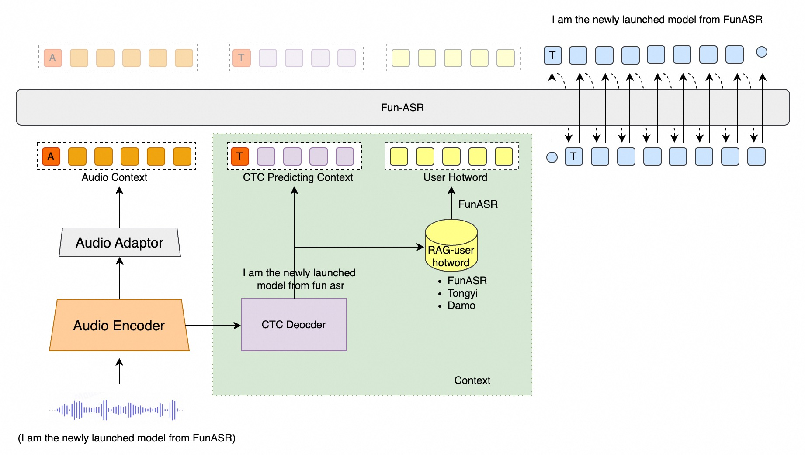

[English](README_NEW.md) | [简体中文](README_zh.md)

<div align="center">

# 🎙️ Fun-ASR All-in-One Docker

[](https://hub.docker.com/r/neosun/fun-asr)
[](LICENSE)

**Production-ready Speech Recognition service based on Fun-ASR-Nano-2512**

One Docker command to get Web UI + REST API + WebSocket + MCP

[Quick Start](#-quick-start) • [Features](#-features) • [API Docs](#-api-reference) • [MCP Guide](MCP_GUIDE.md)

</div>

---

## 📸 Screenshot



## ✨ Features

| Feature | Description |
|---------|-------------|
| 🎯 **Fun-ASR-Nano-2512** | 800M parameter end-to-end ASR model |
| 🌍 **31 Languages** | Chinese, English, Japanese + 28 more |
| 🗣️ **Chinese Dialects** | 7 dialects + 26 regional accents |
| 🔌 **OpenAI Compatible** | Drop-in replacement for Whisper API |
| 🌐 **WebSocket Streaming** | Real-time audio upload with partial results |
| 🤖 **MCP Interface** | Model Context Protocol for AI agents |
| 🎨 **Web UI** | Beautiful Gradio interface |
| 🔥 **Always Loaded** | Model stays in GPU memory |

## 🚀 Quick Start

```bash
docker run -d \
  --name fun-asr \
  --gpus '"device=0"' \
  -p 8189:8189 \
  neosun/fun-asr:latest
```

Then open http://localhost:8189 🎉

## 📦 Installation

### Docker Run

```bash
docker pull neosun/fun-asr:latest

docker run -d \
  --name fun-asr \
  --gpus '"device=0"' \
  -p 8189:8189 \
  -v fun-asr-cache:/root/.cache \
  --restart unless-stopped \
  neosun/fun-asr:latest
```

### Docker Compose

```yaml
services:
  fun-asr:
    image: neosun/fun-asr:latest
    container_name: fun-asr
    restart: unless-stopped
    ports:
      - "8189:8189"
    volumes:
      - fun-asr-cache:/root/.cache
    deploy:
      resources:
        reservations:
          devices:
            - driver: nvidia
              device_ids: ["0"]
              capabilities: [gpu]

volumes:
  fun-asr-cache:
```

### One-Click Start

```bash
git clone https://github.com/neosun100/fun-asr-docker.git
cd fun-asr-docker
chmod +x start.sh
./start.sh
```

## 📡 API Reference

### REST API

#### Transcribe Audio (OpenAI Compatible)

```bash
curl -X POST http://localhost:8189/v1/audio/transcriptions \
  -F "file=@audio.wav" \
  -F "language=auto" \
  -F "hotwords=人工智能,机器学习" \
  -F "itn=true"
```

**Response:**
```json
{
  "text": "这是识别结果",
  "duration": 0.45
}
```

#### Parameters

| Parameter | Type | Default | Description |
|-----------|------|---------|-------------|
| file | file | required | Audio file (wav, mp3, etc.) |
| language | string | "auto" | "auto", "zh", "en", "ja" |
| hotwords | string | "" | Comma-separated hotwords |
| itn | bool | true | Inverse text normalization |

### WebSocket API

Connect to `ws://localhost:8189/ws/transcribe`

**Protocol:**
1. Send config: `{"action": "config", "language": "zh", "sample_rate": 16000}`
2. Send audio chunks (binary)
3. Receive partial results: `{"type": "partial", "text": "..."}`
4. Send end signal: `{"action": "end"}`
5. Receive final result: `{"type": "final", "text": "...", "time": 0.5}`

**JavaScript Example:**
```javascript
const ws = new WebSocket('ws://localhost:8189/ws/transcribe');

ws.onopen = () => {
  ws.send(JSON.stringify({action: 'config', language: 'auto'}));
};

ws.onmessage = (event) => {
  const data = JSON.parse(event.data);
  if (data.type === 'partial') {
    console.log('Partial:', data.text);
  } else if (data.type === 'final') {
    console.log('Final:', data.text);
  }
};

// Send audio chunks
mediaRecorder.ondataavailable = (e) => {
  ws.send(e.data);
};

// End transcription
ws.send(JSON.stringify({action: 'end'}));
```

### Health Check

```bash
curl http://localhost:8189/health
```

## 🤖 MCP Interface

See [MCP_GUIDE.md](MCP_GUIDE.md) for detailed MCP usage.

**Quick Config:**
```json
{
  "mcpServers": {
    "fun-asr": {
      "command": "python",
      "args": ["mcp_server.py"],
      "cwd": "/path/to/Fun-ASR"
    }
  }
}
```

## 🗣️ Supported Languages

### Main Languages
- **Chinese** - 7 dialects (Wu, Cantonese, Min, Hakka, Gan, Xiang, Jin) + 26 regional accents
- **English** - Multiple accents
- **Japanese**

### All 31 Languages
Chinese, English, Cantonese, Japanese, Korean, Vietnamese, Indonesian, Thai, Malay, Filipino, Arabic, Hindi, Bulgarian, Croatian, Czech, Danish, Dutch, Estonian, Finnish, Greek, Hungarian, Irish, Latvian, Lithuanian, Maltese, Polish, Portuguese, Romanian, Slovak, Slovenian, Swedish

## ⚙️ Configuration

| Variable | Default | Description |
|----------|---------|-------------|
| `PORT` | 8189 | Service port |
| `MODEL_DIR` | FunAudioLLM/Fun-ASR-Nano-2512 | Model path |
| `NVIDIA_VISIBLE_DEVICES` | 0 | GPU device ID |

## 📊 Performance

**Test Environment:** NVIDIA L40S GPU

| Audio Length | Recognition Time | RTF |
|--------------|------------------|-----|
| 3s | 0.40s | 0.13x |
| 5s | 0.70s | 0.14x |
| 7s | 0.83s | 0.12x |

> RTF (Real-Time Factor) < 1.0 means faster than real-time

## 🛠️ Tech Stack

- **ASR Model:** [Fun-ASR-Nano-2512](https://huggingface.co/FunAudioLLM/Fun-ASR-Nano-2512)
- **Framework:** FastAPI + Gradio
- **Runtime:** PyTorch + CUDA
- **Protocol:** REST + WebSocket + MCP

## 📄 License

Apache License 2.0

## 🙏 Acknowledgments

- [FunAudioLLM/Fun-ASR](https://github.com/FunAudioLLM/Fun-ASR) - Original Fun-ASR project
